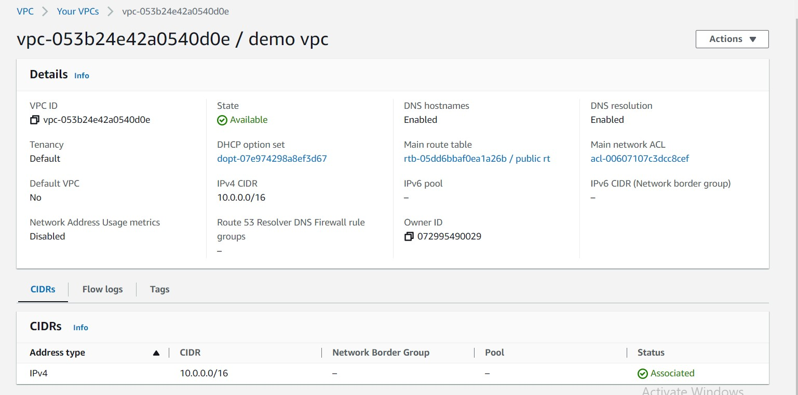
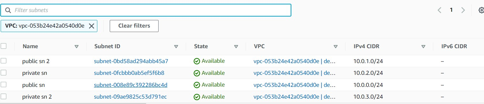
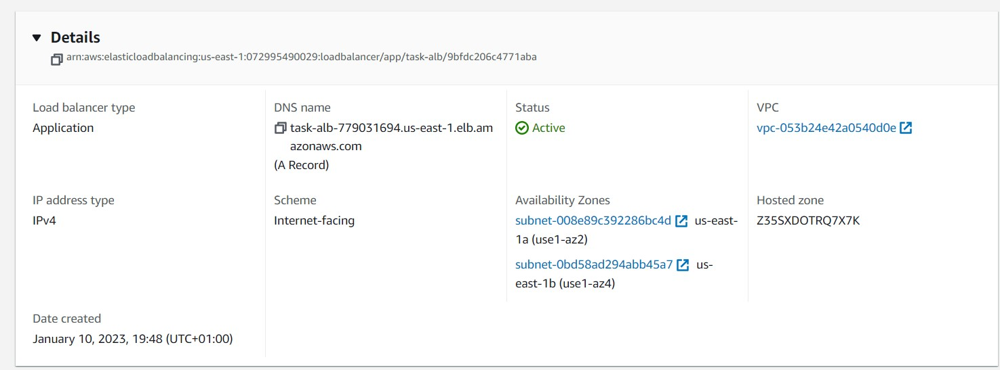
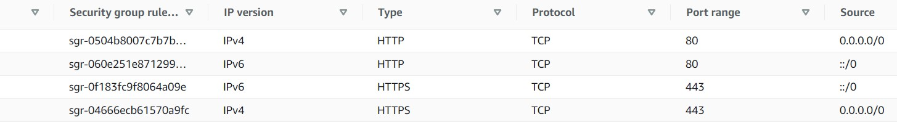
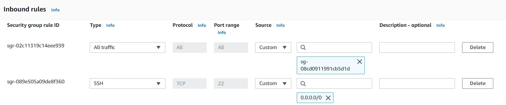
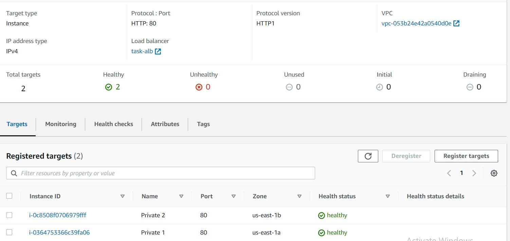

# Dynamic Load Balancing and Web Server Deployment on AWS Using Nginx.
* Set up 2 EC2 instances on AWS. 
* Deploy an Nginx web server on these instances  
* Set up an ALB(Application Load balancer) to route requests to your EC2 instances. 
* Make sure that each server displays its own Hostname or IP address. 
* Access must be only via the load balancer.  
* Define a logical network on the cloud for the servers.  
* EC2 instances must be launched in a private network.  
* Instances should not be assigned public IP addresses.  

### Setting Up Private Network Using AWS  
***
* Create a VPC - Set up name, IPv4 CIDR 

* Create Subnets - Create 4 Subnets - 2 public subnets to be attached to the elastic load balacer and 2 private subnets for the 2 respective load balancers. Choose the same availabilty zone for 1 private and 1 public subnet, then a diferent availability zone for the other 2 subnets and IPv4 CIDRs

* Public Subnet settings 

* Private Subnet settings

* Create Route tables for your private and public subnets - Set up name and choose the VPC just created

* Create an Internet Gateway
* Create a NAT Gateway, Select a Public Subnet (created in the VPC) and allocate an  Elastic IP
* Private RT - Create a new route to 0.0.0.0/0 using a Nat gateway and associate the 2 private subnets to the route table.

* Public RT - Create a new route to 0.0.0.0/0 using a internet gateway and associate the 2 public subnets to the route table.

### Setting up the private instances 
***
- Create 2 EC2 instances in the VPC, using the private subnets for the 2 respective EC2 instances. Create a Security group that allow ssh on port 22.Under Advanced data, click on the User Data and add the bashscript found in userdata.sh then launch the server. Then Launch the instances.     

* Private EC2 instance 1 

* Private EC2 instance 2

### Setting up the Load balancer
***
* Choose an Application Load Balancer, choose a name, choose internet facing scheme, IPv4 IP address type. 
* Choose the VPC created under Network Mapping and choose public subnets under the displayed avaialbility zones (minimum of 2).  
* Create a new security group and allow HTTP and HTTPS traffic on port 443 and port 80.  
* Create a target group, choose instances as target type, HTTP 1 as Protocol version, choose the VPC created for the task and add the private instances as pending then save. Choose the newly created target group and Create the Load Balancer.   
* Screenshot of ALB 
* Security Group of the ALB 
### Updating instance inbound rules
***
* Edit the inbound group rules of the instances security group, allow all traffic and add the security group of the load balancer as the source for the rule and save.

### Target rules
***
* Check target groups to confirm if the target instances are healthy

### Output
***
* Go to the Load balancer, then copy and paste the DNS Name to your browser.
The page will reflect the host name and when the page is refreshed, it will reflect the host name of the second instance.
* Server 1 
* Server 2 
***
ALB DNS Name - task-alb-779031694.us-east-1.elb.amazonaws.com
